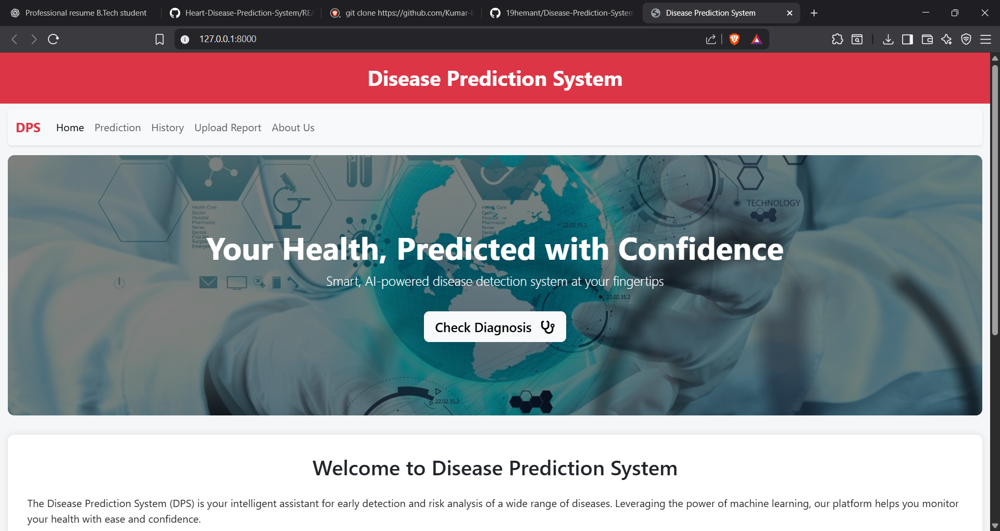
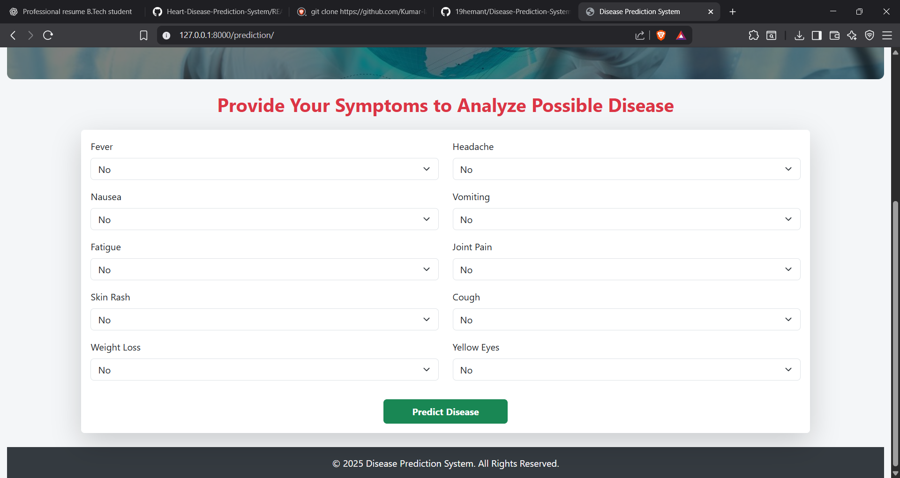
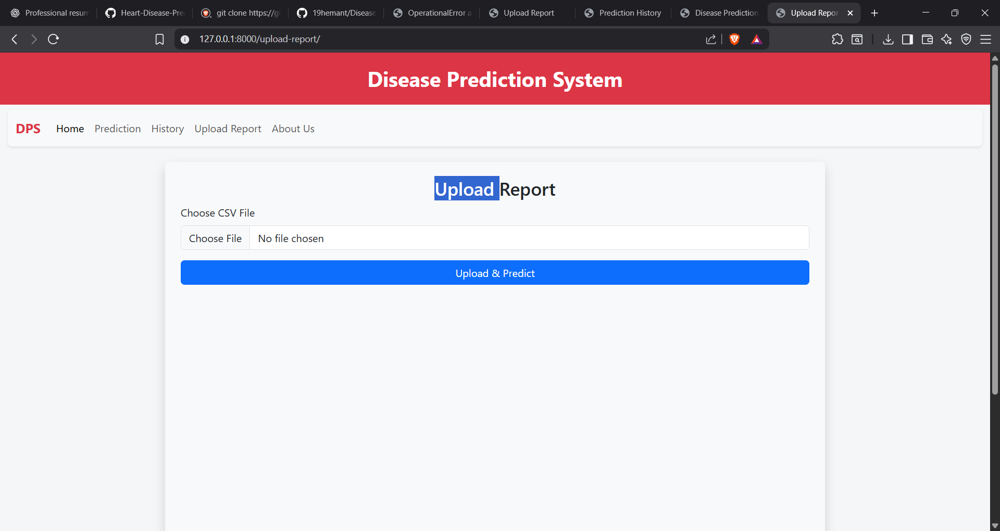
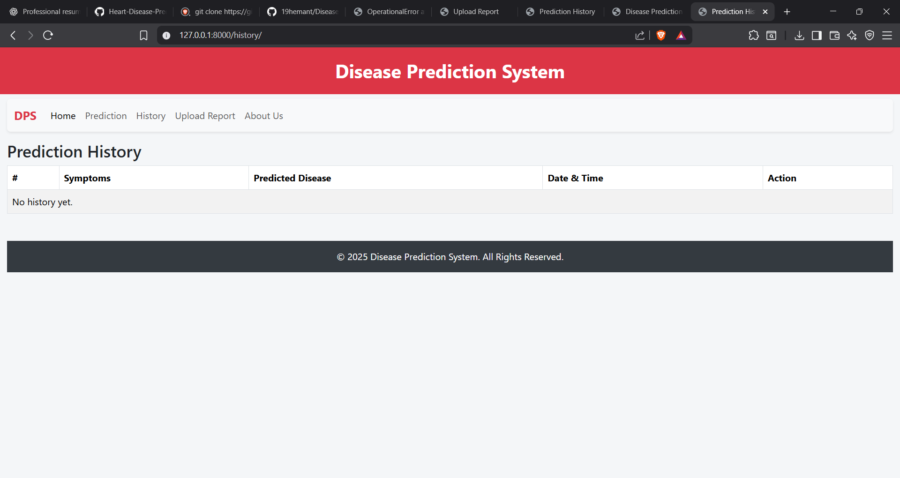
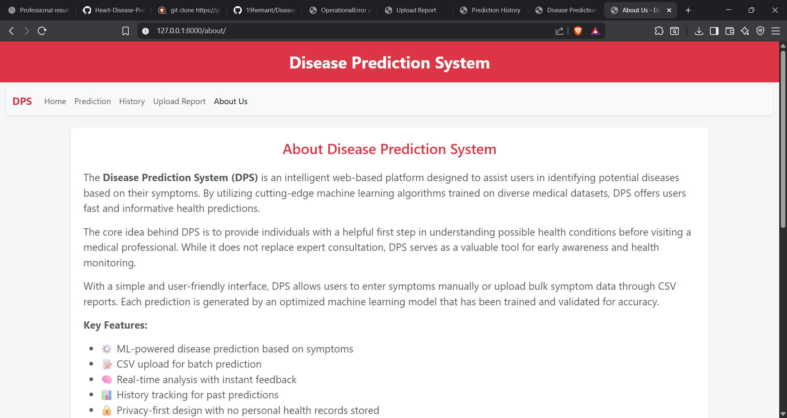

# 🩺 Disease Prediction System  

A Django-based **Machine Learning Web Application** that predicts possible diseases based on user-input symptoms.  
The project was developed as part of my **B.Tech 4th Year Summer Training at Softpro**, showcasing the integration of **Machine Learning with Web Development**.  

The system allows users to input symptoms, upload CSV files for bulk predictions, and view stored prediction history.  

---

## 🚀 Features  
- 🌐 **User-friendly web interface** for disease prediction  
- 📝 Enter symptoms such as *fever, headache, nausea, cough, fatigue, etc.*  
- 📂 **CSV upload option** for predicting diseases for multiple patients  
- 📊 **Prediction history** stored for future reference  
- ⚡ Powered by **Django + Machine Learning (Scikit-learn)**  
- 💾 Uses **SQLite database** for easy management  

---

## 🛠️ Tech Stack  
- **Frontend:** HTML, CSS, Bootstrap  
- **Backend:** Django (Python)  
- **Database:** SQLite  
- **Machine Learning:** Scikit-learn, Pandas, NumPy  

---

## 📂 Project Structure  
```
├── dp_project/          # Main Django project folder
├── dp_app/              # Application (views, models, ML logic)
├── templates/           # HTML files (index, prediction, history, csvupload)
├── static/              # CSS, JS, Images
├── db.sqlite3           # SQLite database
├── manage.py            # Django management file
├── requirements.txt     # Project dependencies
└── README.md            # Project documentation
```  

---

## ⚙️ Installation & Setup  

1. **Clone the repository**  
```bash
git clone https://github.com/19hemant/Disease-Prediction-System.git
cd Disease-Prediction-System
```  

2. **Create virtual environment**  
```bash
python -m venv venv
venv\Scripts\activate      # On Windows
source venv/bin/activate     # On Mac/Linux
```  

3. **Install dependencies**  
```bash
pip install -r requirements.txt
```  

4. **Run migrations**  
```bash
python manage.py migrate
```  

5. **Run the server**  
```bash
python manage.py runserver
```  

6. **Open in browser**  
```
http://127.0.0.1:8000/
```  

---

## 📊 Usage  
- Go to **Prediction Page** → enter symptoms → click *Predict*.  
- Go to **CSV Upload Page** → upload CSV with patient data.  
- Go to **History Page** → view past predictions.  

---

## 📸 Screenshots  
### 🏠 Home Page  
  

### 🩺 Prediction Page  
  

### 📂 CSV Upload Page  
  

### 📊 History Page  
  
### 📊  About Page  
  


---

## 🧩 Future Enhancements  
- Integration of **deep learning models** for higher accuracy  
- **REST API** support for external systems  
- **User authentication** for personalized prediction history  
- Deploy on **cloud platforms** like Heroku / AWS  

---

## 👨‍💻 Author  
**Hemant Singh Shah**  
🎓 B.Tech 4th Year Student  
☀️ Summer Training at Softpro  
💡 Passionate about Web Development & Machine Learning  

---

## 📝 License  
This project is licensed under the MIT License.  
